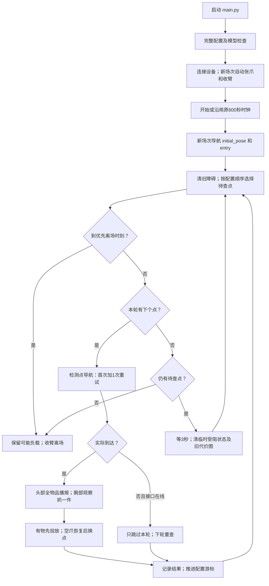
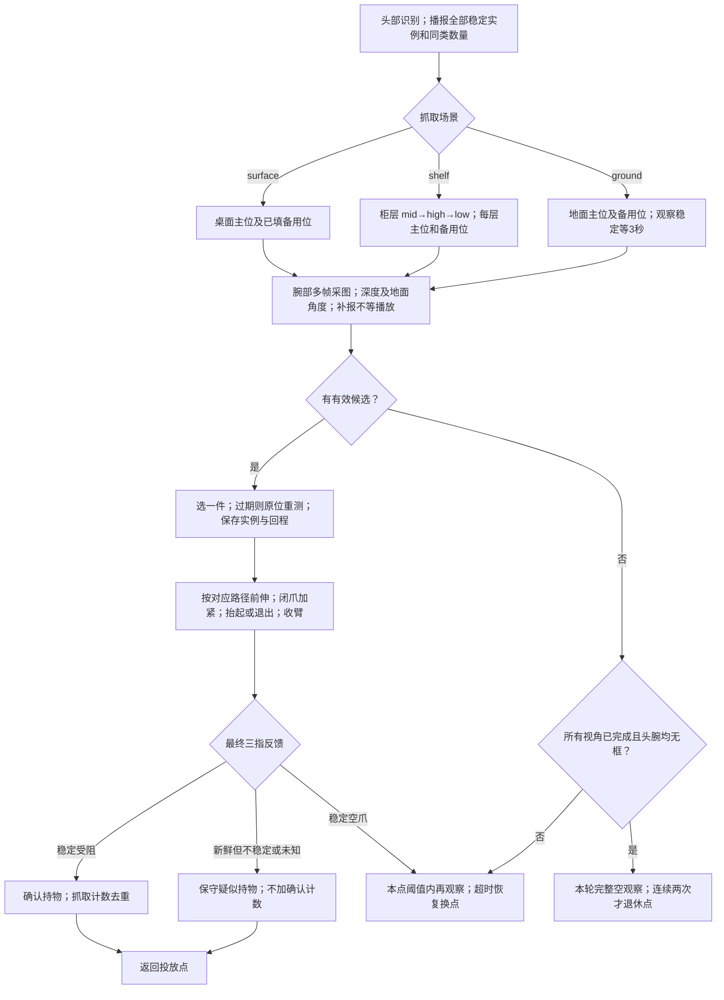
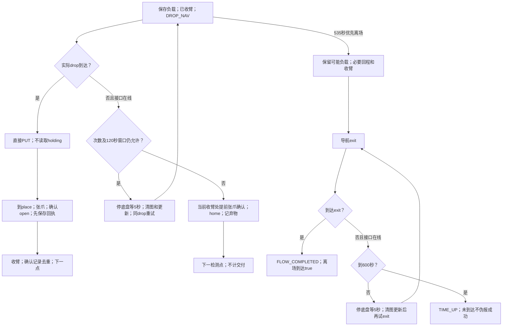
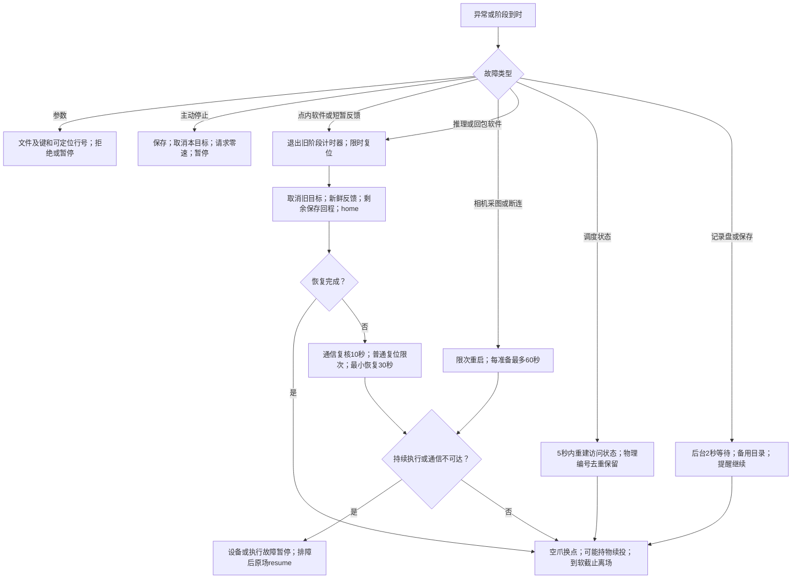

# main、抓取及异常分支逻辑（v13）

更新：2026-10-07。完整竖向图按参考图的蓝色主线、黄色判断、绿色抓放、紫色柜层和红色暂停绘制：[PNG](MAIN_FLOW_V13.png) / [SVG](MAIN_FLOW_V13.svg)。以下拆成四张小图，便于逐段看分支。所有秒数见[TIMEOUTS](TIMEOUTS.md)，逐项原因及排查见[ERROR_GUIDE](ERROR_GUIDE.md)。

## 1. main与路线循环

配置/设备准备失败发生在开始前；initial/entry重试失败允许暂停。恢复已完成入场时不回起点，先核对负载及保存的剩余回程，再续投或接当前路线。default起点导航与--set-initial-pose发布定位是两件事。

当前软截止535秒，计算为 `600-max(30,45+20)`。每阶段都受更早的点内/动作/软/硬截止约束；离场只屏蔽软截止，不屏蔽600秒或主动停止。未知参数错误按文件/键/行号报告，不能吞成点位无物品。

## 2. 家具观察与一件抓取

桌面保留坐标变换及抬起/回程；柜层保留v2中间点、抓取点、抬起和退出；地面保留catch_ty横移、前伸、下降、75/100闭爪后直接home。它们分别在pick及coordinates模块，当前修订没有重写物理公式。

候选不稳定、深度无效、过期、观察位未到达、抓空、软件异常，都不是判空依据。到点总阈值桌/柜120秒、现有地面180秒。超时离开旧计时器再复位，空爪提前张开/收臂，疑似持物保留并续投。原位备用观察姿态会轮换；底盘多点按配置顺序重新导航和拍照，reposition_points关系不触发立即插队。

6750边界不暂停；稳定受阻才计确认抓取，新鲜不稳定只保守携带。动作结果状态3、新鲜有效位姿存在时，附加15mm/5°误差只提示。持续无反馈仍需设备诊断，不用旧XYZ猜坐标。

## 3. 投放与离场优先

DROP共3次、总120秒包含导航/等待/清图，任一先到结束。到drop直接PUT，只在释放后确认张开；已释放但home失败恢复不重复释放；软截止离场及总截止收尾也会补登记已完成释放的回执一次。疑似持物也执行PUT但不计确认交付，区内落点和途中未滑落没有独立传感器证明。

时间不足优先离场可持物、可0交付；它不会先去下一家具，也不因软截止主动弃物。收臂是底盘继续移动的必要执行步骤，硬件持续无法收臂仍可能暂停。离场失败不安排转圈示意，move_base是否旋转看其恢复/控制日志。

## 4. 特殊情况与恢复

复位普通最多两次，各30秒，失败复核设备10秒、两次间隔2秒；最后独立最小恢复仍30秒。不是无限恢复等待。持续未取消/未收臂/未开爪不能伪造travel_ready。C扩展信号延迟、硬杀/OOM/断电、持续未覆盖软件损坏不保证自动继续。

模块分工：main入口与错误输出；RobotSession设备、时钟和checkpoint；Workflow路线/投放/离场；PointScheduler配置順序/完整判空；Recovery通信及有限复位；Actions负载/回程，独立pick/grasp/put/release执行。详细文件清单见[UPDATE_V13.md](UPDATE_V13.md)。三级开门/抽屉接口保留未启用，本图的正常抓取是一级/二级，不自动重复未确认开门。
